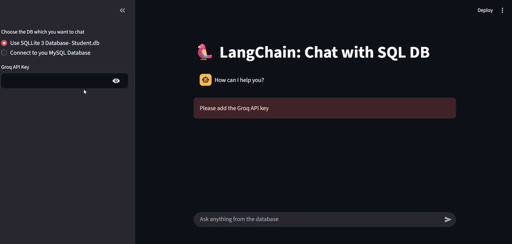

# LangChain: Chat with SQL Database 🦜

A Streamlit application that allows users to interact with SQL databases using natural language queries powered by LangChain and Groq LLM.

## Link
[Click Here](https://sql-agent-ai.streamlit.app)
## Demo

## Features

- Chat interface for querying SQL databases
- Support for both SQLite and MySQL databases
- Natural language to SQL query conversion
- Real-time streaming responses
- Conversation history management
- Secure credential handling
- Shows every step taken by model

## Prerequisites

- Python 3.x
- Groq API key
- MySQL server (optional, for MySQL database support)

## Installation

```bash
# Clone the repository
git clone <repository-url>
cd ChatSQL

# Install required packages
pip install -r requirements.txt
```

## Setup

1. For SQLite database:
   - The default `student.db` is included with sample student data
   - No additional configuration needed

2. For MySQL database:
   - Have your MySQL server credentials ready
   - You'll need:
     - Host address
     - Username
     - Password
     - Database name

3. Get your Groq API key from [Groq's website](https://groq.com)

## Usage

1. Start the application:
```bash
streamlit run app.py
```

2. In the sidebar:
   - Choose your database type (SQLite/MySQL)
   - If using MySQL, enter your database credentials
   - Enter your Groq API key

3. Start chatting with your database using natural language!

Example queries:
- "Show me all students in Data Science class"
- "What is the average marks in DEVOPS section?"
- "Who has the highest marks?"

## Project Structure

- `app.py`: Main Streamlit application
- `sqlite.py`: SQLite database initialization script
- `student.db`: Sample SQLite database

## Technologies Used

- [Streamlit](https://streamlit.io/)
- [LangChain](https://langchain.readthedocs.io/)
- [Groq](https://groq.com/)
- SQLite/MySQL
- SQLAlchemy
